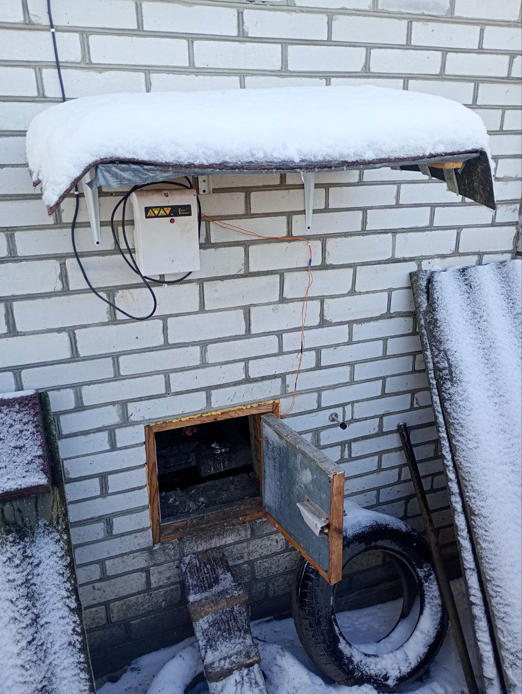
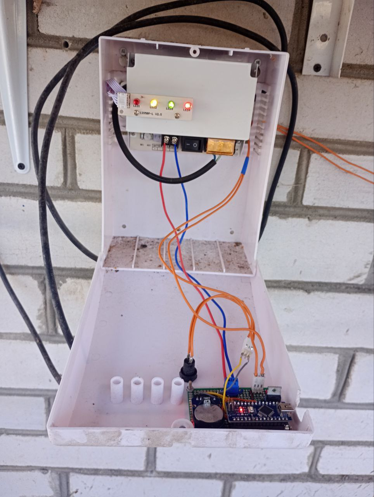

# ChickenDoor

Автоматизована система відкривання хвіртки для курей на світанку. Побудована на **Arduino Uno** з використанням **RTC DS3231** та **12V соленоїда**. Щодня система планує наступне спрацювання на час світанку для м. **Київ** та відкриває хвіртку механічним розблокуванням пружини.

<p align="center">
  
  
</p>


## Мета проєкту

Створити **надійну та довготривалу** систему, яка **кожного ранку** відкриватиме хвіртку курей у момент світанку, мінімізуючи потребу в ручному контролі.

## Як це працює (огляд)

1. У прошивці збережено таблицю часу світанку на кожен день року для локації **Київ**.
2. Arduino щодня виставляє на RTC (DS3231) **будильник на наступний день** на час світанку.
3. Коли будильник спрацьовує, RTC генерує сигнал, який викликає **апаратне переривання** на Arduino.
4. Переривання активує **соленоїд**, який виходить із пазу, та **пружина відкриває хвіртку**.
5. Після спрацювання Arduino планує будильник на **наступний день**.

Додатково передбачено:
- **керування/діагностику через Serial-порт**;
- **ручне відкриття кнопкою** на випадок збою.

## Механіка хвіртки

Хвіртка відкривається пружиною, але у штатному стані її утримує соленоїд:
- у стані спокою соленоїд **заходить у паз** і блокує хід;
- при активації соленоїда він **виходить із пазу**, після чого пружина **відчиняє хвіртку**.

## Апаратна частина

- **Контролер:** Arduino Uno  
- **Годинник реального часу (RTC):** DS3231  
- **Соленоїд:** 12V, 1.2A  
- **Ключ керування соленоїдом:** MOSFET  
- **Захист соленоїда:**
  - **діод (flyback diode)** для гасіння ЕРС самоіндукції при вимиканні котушки;
  - **запобіжник** у силовому ланцюзі соленоїда на випадок надмірного струму/короткого замикання.
- **Живлення:** блок 12V, 3A (типовий блок живлення для відеоспостереження; використано як більш захищене рішення для вологих умов)

## Таблиця світанків (дані)

Час світанку збережено у вигляді таблиці структур `SunriseTime` (місяць, день, година, хвилина). Дані зберігаються у Flash-пам’яті (PROGMEM).

Формат:

```cpp
struct SunriseTime {
    uint8_t month;
    uint8_t day;
    uint8_t hour;
    uint8_t minute;
};
```

## Таблиця світанків (дані)

Час світанку збережено у вигляді таблиці структур `SunriseTime` (місяць, день, година, хвилина). Дані зберігаються у Flash-пам’яті (PROGMEM).

Пошук значення для поточної дати здійснюється функцією `getSunrise(month, day, ...)`, яка проходить по таблиці та повертає відповідний час.

## Генерація таблиці (Python)

Таблиця світанків була автоматично згенерована Python-скриптом, який:

- завантажує календар світанків з сайту `sunrise-sunset.org`,
- парсить HTML (`BeautifulSoup`),
- друкує C++-ініціалізатор масиву `SunriseTime sunriseTable[]`.

У поточній версії скрипта використовується сторінка календаря з локацією:

- `Vasylkiv, Kyiv Oblast` (в межах Києва/Київської області)

За потреби для іншого міста достатньо змінити параметр `location` у `base_url` та згенерувати таблицю заново.

## Алгоритм планування будильника

- Щодня Arduino бере час світанку для **наступного дня** з таблиці.
- Виставляє будильник на **DS3231**.
- На подію будильника реагує через **переривання** та запускає імпульс на соленоїд для відкриття хвіртки.
- Після спрацювання повторює цикл (планує наступний день).

## Керування та діагностика через Serial

Система підтримує базові команди (приклади з коду обробника `checkSerial`):

- `GET_ALARM` — показати встановлений час будильника
- `LIST_LOG` — вивести журнал спрацювань (за наявності реалізації `listLog()`)
- `LAST_LOG` — показати останній запис журналу
- `TIME_NOW` — показати поточний час RTC

Журнальний функціонал у проєкті використовується для перевірки коректності роботи та контролю останніх спрацювань.

## Ручне відкриття

Передбачено кнопку, яка активує соленоїд та відкриває хвіртку вручну — як резервний сценарій на випадок збою програми або для тестування механіки.

## Надійність (факт експлуатації)

Система працює без втручання приблизно **пів року**.

